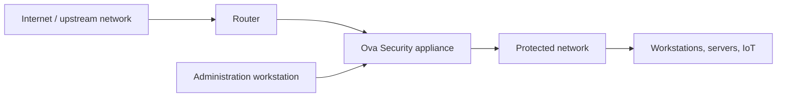
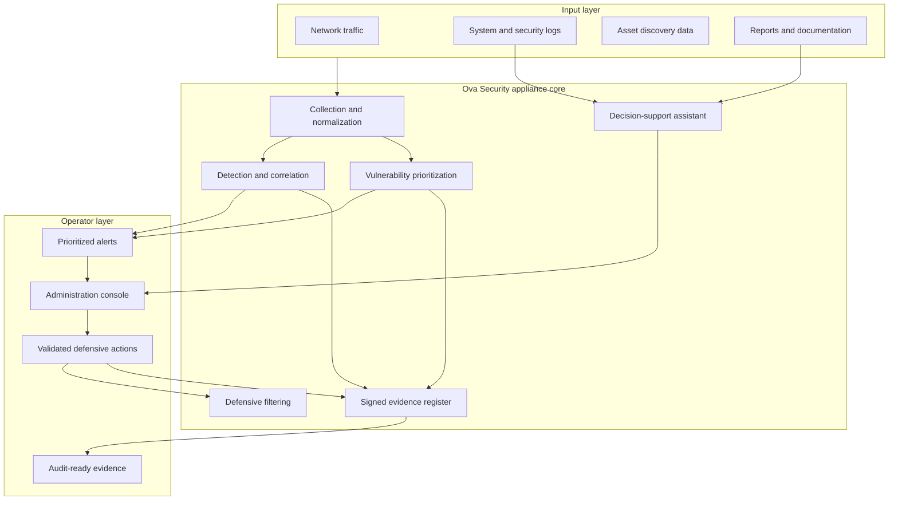
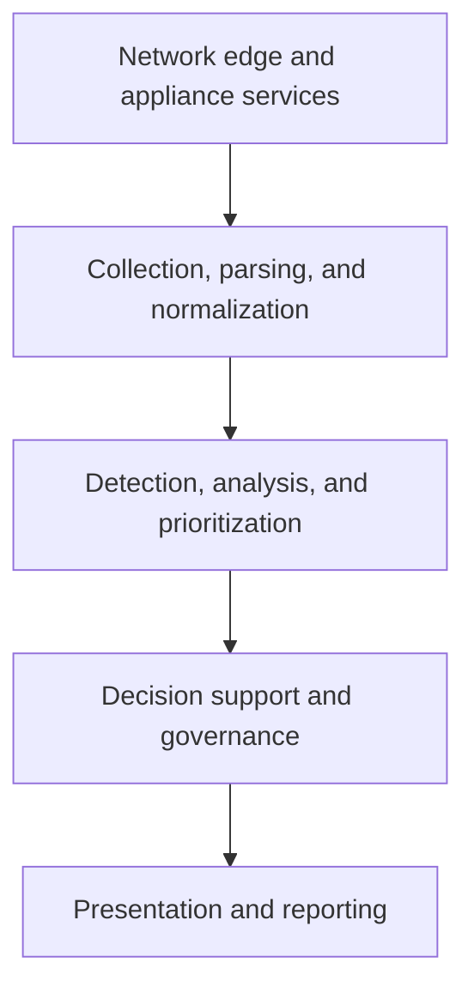
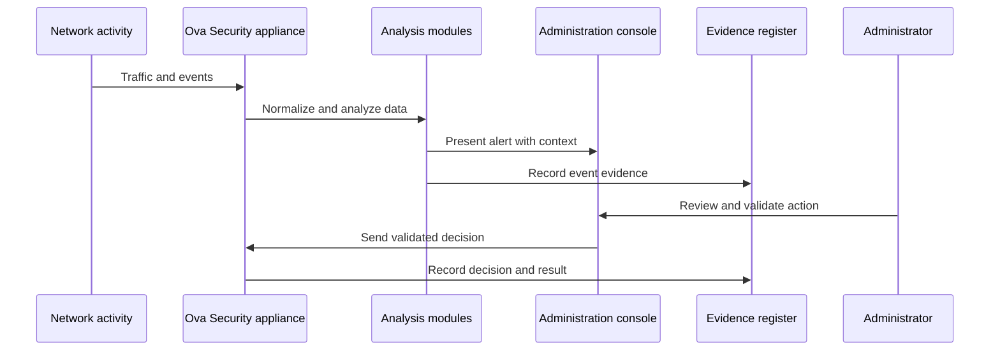
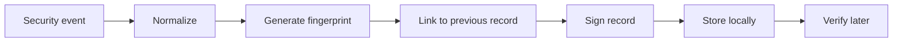
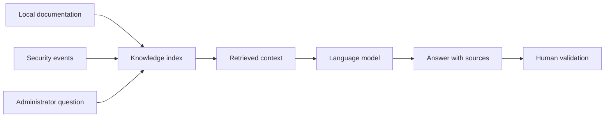
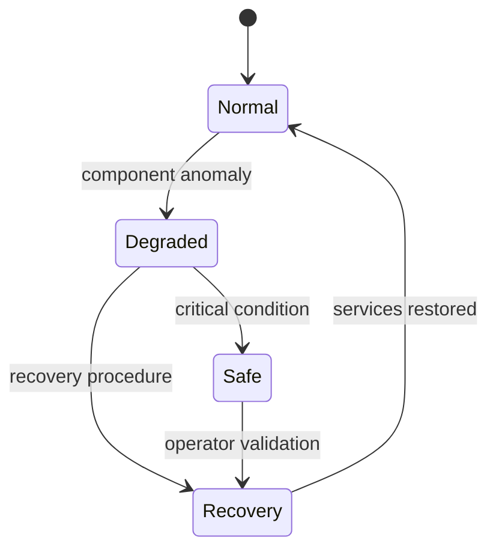
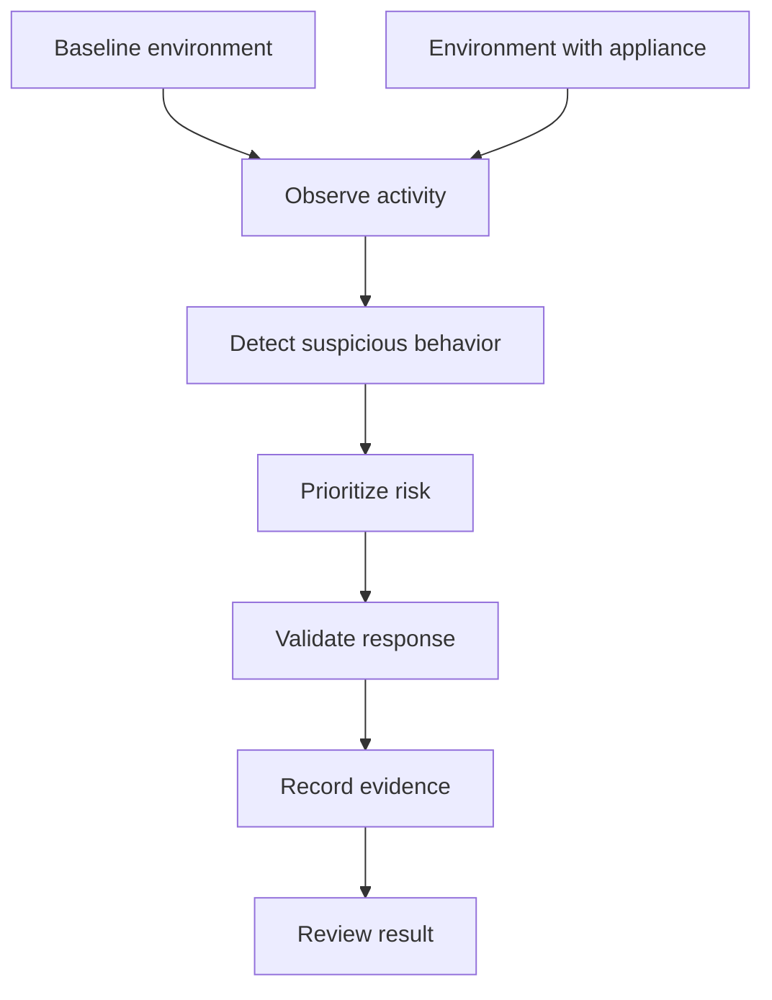

# Ova Security

Ova Security is a compact cybersecurity appliance architecture designed to improve local network visibility, defensive control, event traceability, and assisted decision-making.

This repository is intentionally public and limited to a technical architecture overview. It does not contain source code, credentials, production configuration, private IP addresses, offensive procedures, or internal operational secrets.

## 1. Project vision

Many small and medium networks have the same security problem: tools are separated, logs are difficult to exploit, alerts lack context, and decisions are hard to justify during an incident or an audit.

Ova Security proposes a local appliance that centralizes the main defensive functions:

- observe the network and connected assets;
- detect suspicious activity;
- prioritize vulnerabilities and risky devices;
- apply controlled defensive filtering;
- keep signed local evidence;
- help administrators interpret events and reports.

The goal is not to replace a full security operations center. The goal is to provide a compact, understandable, locally controlled layer for environments that need better visibility and stronger governance without deploying a complex security platform.

## 2. High-level architecture

The appliance is placed at the network edge, between the upstream router and the protected network. It observes traffic, receives security events, consolidates relevant information, and exposes a controlled administration surface.

## 3. Logical architecture

## 4. Main functional modules

| Module | Role | Output |
| --- | --- | --- |
| Asset inventory | Identifies active devices and tracks their state. | Known assets, unknown assets, risk context. |
| Network observation | Collects network activity and service signals. | Flow visibility and suspicious behavior indicators. |
| Intrusion detection | Detects abnormal or hostile activity patterns. | Alerts with severity and affected assets. |
| Vulnerability analysis | Helps identify exposed services and weaknesses. | Prioritized remediation list. |
| Defensive filtering | Applies approved filtering decisions. | Controlled access restrictions. |
| Evidence register | Records important events and decisions. | Signed and verifiable traceability. |
| Assistant | Helps explain alerts, reports, and context. | Human-readable analysis with sources. |
| Reporting | Produces operational and audit-oriented summaries. | Reports for administrators and reviewers. |

## 5. Layered design

### Network edge and appliance services

This layer represents the physical and logical position of the appliance. It provides the network point where traffic can be observed and where approved defensive policies can be enforced.

### Collection, parsing, and normalization

This layer transforms heterogeneous events into a consistent internal format. It reduces fragmentation between network traffic, system logs, vulnerability information, and administrative actions.

### Detection, analysis, and prioritization

This layer turns raw observations into security signals. It connects suspicious activity to assets and gives the administrator a clearer view of what matters first.

### Decision support and governance

This layer ensures that sensitive actions remain controlled. The assistant can explain and recommend, but final validation stays with the administrator.

### Presentation and reporting

This layer provides the operator-facing view: assets, alerts, risks, health state, reports, and evidence summaries.

## 6. Data flow

## 7. Traceability model

Traceability is designed as a cross-cutting function. Important events and decisions are recorded in a local evidence register.

The register helps answer operational and audit questions:

- what happened;
- which asset was involved;
- which decision was taken;
- who validated the response;
- when the action was applied;
- whether the evidence remained coherent after storage.

This public description does not disclose private keys, exact record formats, production logs, or internal signing material.

## 8. Assistant architecture

The assistant is a decision-support component. It helps administrators understand information faster, but it does not replace human validation.

The assistant can be used to:

- explain an alert in plain language;
- summarize an incident report;
- connect an event to available documentation;
- propose checks to perform;
- help prepare a response that still requires validation.

Guardrails:

- no sensitive action should be executed without validation;
- responses should be grounded in available context;
- private operational data should remain inside the controlled environment;
- the assistant should support the operator, not become the decision maker.

## 9. Resilience model

Ova Security includes a resilience model so that essential functions remain understandable during degraded situations.

| Mode | Meaning |
| --- | --- |
| Normal | Core services are available and the appliance operates as expected. |
| Degraded | A non-critical function is affected, but essential monitoring continues. |
| Recovery | The system attempts to restore service health and records the recovery process. |
| Safe | The appliance limits behavior to essential defensive functions and requests operator attention. |

## 10. Validation approach

The architecture can be validated through controlled defensive scenarios. The public repository only describes the validation method at a high level.

Validation criteria:

- assets are discovered and classified;
- suspicious activity is detected;
- alerts are associated with the relevant device;
- risks are understandable for the administrator;
- defensive responses are controlled;
- evidence is preserved for later review;
- degraded states remain visible.

This repository does not provide attack commands, exploit steps, operational firewall rules, real addresses, or private screenshots.

## 11. Security and publication boundaries

This repository is safe for public presentation because it intentionally excludes:

- appliance source code;
- production configuration;
- secrets, tokens, keys, credentials, and certificates;
- private network addresses and access endpoints;
- raw logs, packet captures, or customer data;
- internal prompts, private datasets, or model credentials;
- offensive procedures or reproducible attack instructions.

## 12. Summary

Ova Security is designed as a local cybersecurity appliance that combines visibility, detection, controlled filtering, traceability, resilience, and decision support.

Its main architectural value is the centralization of defensive information in a format that remains understandable for administrators and usable during audits, while keeping sensitive operational details private.

## License

This repository is proprietary documentation. See [LICENSE](LICENSE).
