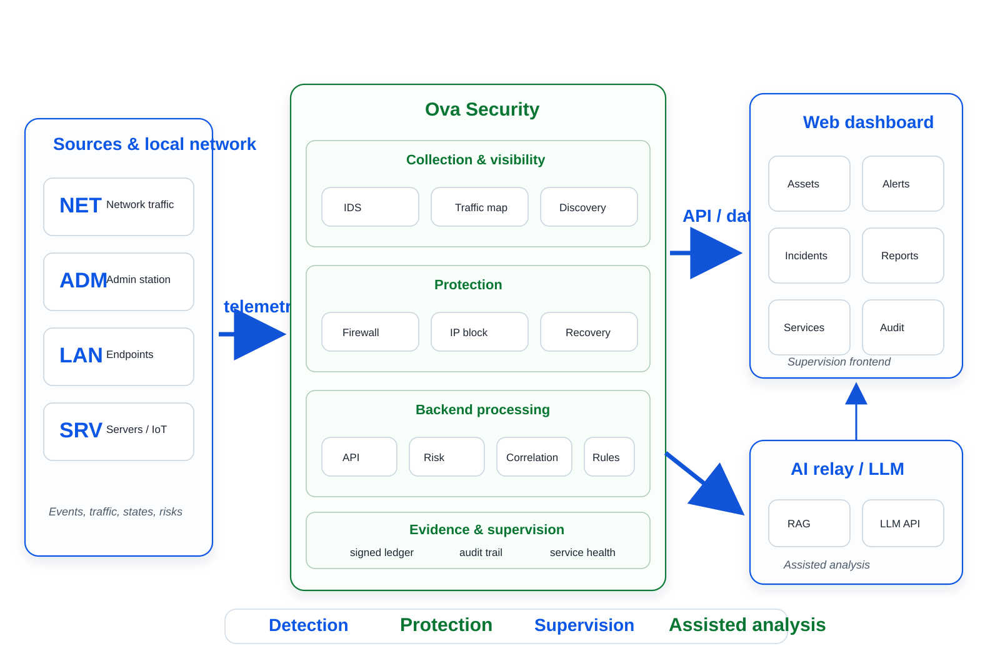
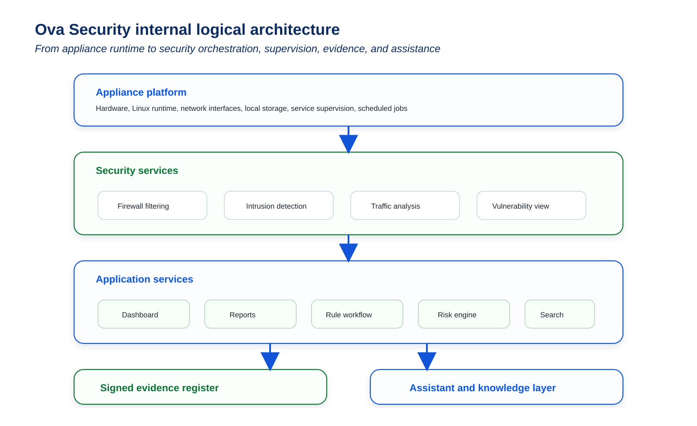
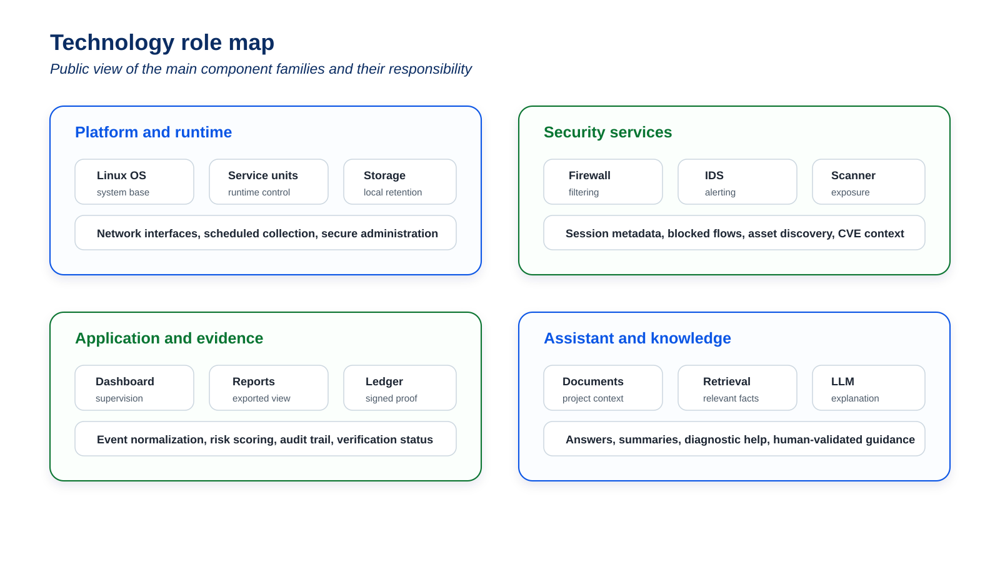
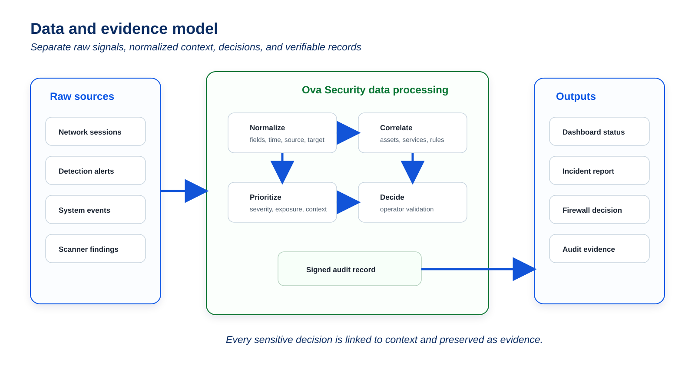
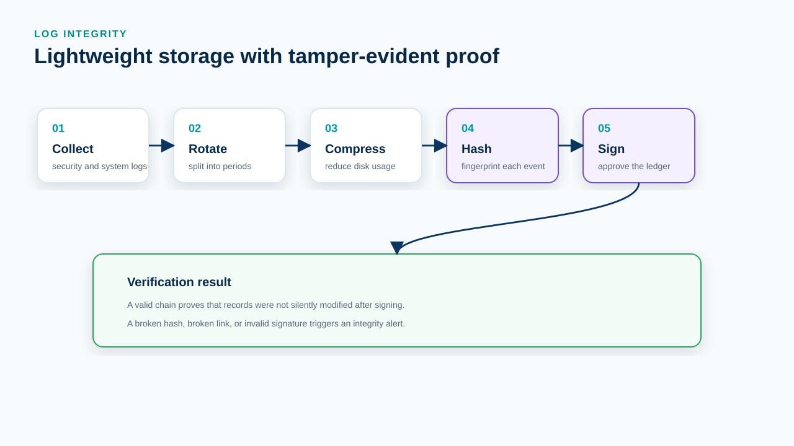
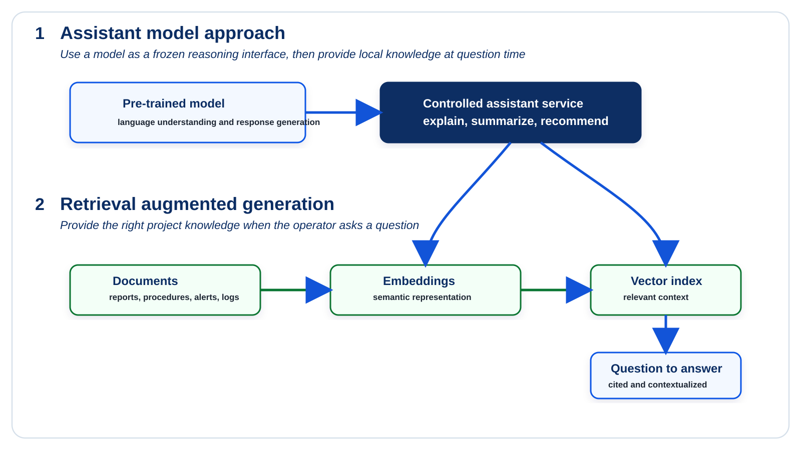
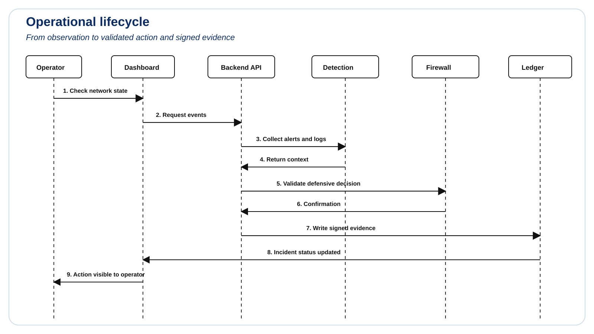

# Ova Security

Public architecture documentation for **Ova Security**, a compact wired cybersecurity appliance designed to observe, filter, audit, and preserve local evidence for small and medium networks.

This repository presents the architecture at a public level. It does not contain secrets, internal credentials, production configuration, private deployment procedures, or customer data.

## Contents

- [Product overview](#product-overview)
- [Edge network position](#edge-network-position)
- [Internal architecture](#internal-architecture)
- [Functional modules](#functional-modules)
- [Technology role map](#technology-role-map)
- [Data and evidence model](#data-and-evidence-model)
- [Log integrity and auditability](#log-integrity-and-auditability)
- [Assistant and knowledge layer](#assistant-and-knowledge-layer)
- [Operational lifecycle](#operational-lifecycle)
- [Security boundaries](#security-boundaries)
- [License](#license)

## Product overview

Ova Security is positioned as an **edge cyber appliance**: a local box installed between the internet access point and the protected internal network. Its objective is to bring together monitoring, filtering, vulnerability visibility, audit evidence, and operator assistance in one controlled platform.

The product is built around four principles:

| Principle | Meaning |
| --- | --- |
| Local control | Security decisions, logs, and evidence remain under the operator's control. |
| Wired-first deployment | The appliance is placed on a physical network path to separate internet, protected LAN, and administration access. |
| Explainable operations | Alerts, blocked flows, scans, and administrative actions are presented with traceable context. |
| Evidence preservation | Important events are recorded in an integrity-oriented register so later changes can be detected. |

## Edge network position

Ova Security is designed to sit at the edge of the protected network. It receives traffic from the upstream router, applies filtering and inspection, then exposes only validated flows toward internal equipment.

### Network zones

| Zone | Role |
| --- | --- |
| WAN / upstream | External connectivity coming from the router or internet access equipment. |
| Appliance edge | Filtering, monitoring, logging, vulnerability visibility, and evidence generation. |
| Protected LAN | Workstations, servers, IoT devices, and internal services. |
| Administration | Restricted management access for operators and maintainers. |

## Internal architecture

The platform is structured in layers. Each layer has a clear responsibility so the solution can remain understandable, auditable, and maintainable.

### Layer responsibilities

| Layer | Responsibility |
| --- | --- |
| Hardware and OS | Hosts the appliance runtime, network interfaces, local storage, and system services. |
| Network security services | Filters traffic, observes sessions, detects suspicious behavior, and maps exposed services. |
| Application services | Converts raw technical events into dashboard data, reports, audit records, and operator workflows. |
| Evidence and assistant layer | Preserves important actions, validates integrity, and helps the operator understand incidents. |

## Functional modules

Ova Security is presented as a product, not as a collection of disconnected tools. The modules below form one operational chain.

| Module | Purpose | Typical output |
| --- | --- | --- |
| Firewall control | Blocks unauthorized inbound or lateral traffic according to validated rules. | Allowed/refused flows, rule status, blocked sources. |
| Intrusion detection | Observes network traffic and detects suspicious patterns. | Alerts, severity, affected host, detection context. |
| Network mapping | Identifies visible devices, services, and communication patterns. | Asset inventory, exposed ports, topology hints. |
| Vulnerability visibility | Associates services and hosts with known weaknesses. | Prioritized findings and remediation guidance. |
| Log management | Collects, rotates, compresses, and retains operational logs. | Searchable event history and controlled storage usage. |
| Integrity register | Chains and signs important events to detect later alteration. | Verifiable audit trail. |
| SOC assistant | Explains alerts, reports, logs, and procedures in operator language. | Summaries, diagnostic steps, recommended actions. |

## Technology role map

The implementation can rely on well-known open-source components while keeping the product value in integration, orchestration, presentation, and evidence handling.

| Component family | Public role |
| --- | --- |
| Linux services | Base operating environment, service supervision, scheduled tasks, and local process control. |
| Firewall engine | Packet filtering, rule application, and controlled network segmentation. |
| IDS / network analysis | Traffic observation, protocol analysis, alert generation, and session metadata. |
| Vulnerability scanner | Controlled discovery and vulnerability assessment of selected assets. |
| Web application | Dashboard, reports, search, administration, and operator workflows. |
| Local evidence store | Stores signed records, log metadata, configuration changes, and audit history. |
| Assistant layer | Uses project documentation and local events to answer operational questions. |

## Data and evidence model

The architecture separates raw logs, normalized events, operator actions, and signed evidence. This separation makes the platform easier to audit and safer to operate.

### Main data families

| Data family | Examples | Treatment |
| --- | --- | --- |
| Network events | Connections, DNS activity, protocol metadata, IDS alerts. | Normalized, indexed, linked to assets. |
| Security decisions | Blocked traffic, accepted rules, validated exceptions. | Recorded with timestamp, source, and operator context. |
| Asset information | Hostnames, services, observed ports, device categories. | Updated over time and used to contextualize risks. |
| Vulnerability findings | CVE references, severity, affected service, remediation status. | Prioritized and connected to assets. |
| Audit records | Configuration changes, sensitive actions, register updates. | Hashed, chained, signed, and verifiable. |

## Log integrity and auditability

The log strategy has two goals: keep the system lightweight and preserve proof. The appliance should reduce disk usage without destroying the chain of evidence.

### Integrity workflow

1. Security events and sensitive actions are normalized.
2. Each important record receives a cryptographic hash.
3. Records are chained with the previous hash.
4. The chain is signed by the appliance.
5. Verification checks the signature, hashes, and chain continuity.
6. Any later modification breaks the chain and raises an integrity alert.

### Log lifecycle

| Step | Goal |
| --- | --- |
| Collection | Gather events from network, security, system, and application services. |
| Rotation | Split active logs into controlled periods. |
| Compression | Reduce storage pressure without losing traceability. |
| Retention | Keep useful history according to operational policy. |
| Signed ledger | Preserve a tamper-evident trace of important events. |

## Assistant and knowledge layer

The assistant is not a replacement for the operator. It is a support layer that helps interpret alerts, explain logs, summarize reports, and propose diagnostic steps from approved project knowledge.

### Assistant capabilities

| Capability | Description |
| --- | --- |
| Natural questions | The operator asks questions in plain language. |
| Context retrieval | The assistant uses indexed documentation, reports, logs, and known procedures. |
| Alert explanation | Events are translated into understandable risk context. |
| Action guidance | The assistant proposes next steps, checks, and remediation paths. |
| Human validation | Sensitive actions remain under operator control. |

## Operational lifecycle

The architecture supports a continuous cycle: observe, understand, decide, act, and prove.

| Phase | Description |
| --- | --- |
| Observe | Collect network, service, system, and security signals. |
| Correlate | Link events to assets, services, rules, and previous activity. |
| Prioritize | Highlight the most important risks first. |
| Decide | Let the operator validate rules, exceptions, and remediation actions. |
| Enforce | Apply firewall or operational decisions in a controlled way. |
| Prove | Store a signed trace of sensitive changes and security decisions. |

## Security boundaries

This repository intentionally avoids publishing operational details that would weaken a real deployment.

Published:

- Product-level architecture
- Public module descriptions
- High-level data flows
- Public validation logic
- Documentation license

Not published:

- Secrets, keys, tokens, or credentials
- Real customer data
- Private network addresses
- Production firewall rules
- Internal deployment scripts
- Exploit procedures or offensive playbooks

## License

This documentation, diagrams, structure, and written content are protected by the license included in [LICENSE](LICENSE). Public visibility does not grant permission to copy, reuse, resell, rebrand, or redistribute the project content.
