# Ova Security

Ova Security is a compact cybersecurity appliance architecture for local networks. It is designed to centralize visibility, detection, controlled filtering, vulnerability prioritization, traceability, resilience, and assisted decision-making inside a single defensive platform.

This public repository contains only the architectural presentation of the project. It does not include source code, credentials, production configuration, private network addresses, exploit procedures, customer data, or internal operational secrets.

## Table of contents

- [1. Vision](#1-vision)
- [2. Architecture overview](#2-architecture-overview)
- [3. Wired network architecture](#3-wired-network-architecture)
- [4. Internal logical architecture](#4-internal-logical-architecture)
- [5. Functional modules](#5-functional-modules)
- [6. Technology role map](#6-technology-role-map)
- [7. Data domains](#7-data-domains)
- [8. Event and decision flow](#8-event-and-decision-flow)
- [9. Log management and traceability](#9-log-management-and-traceability)
- [10. Integrity register](#10-integrity-register)
- [11. Assistant architecture](#11-assistant-architecture)
- [12. Resilience model](#12-resilience-model)
- [13. Administration and governance](#13-administration-and-governance)
- [14. Validation approach](#14-validation-approach)
- [15. Public boundaries](#15-public-boundaries)
- [16. License](#16-license)

## 1. Vision

Small and medium networks often sit between two extremes: minimal protection on one side, and complex enterprise security platforms on the other. Ova Security targets this middle ground with a local appliance that is easier to understand, deploy, operate, and audit.

The product idea is simple:

- place a dedicated appliance near the network edge;
- observe assets, flows, alerts, and service health;
- convert raw technical signals into understandable security context;
- let the administrator validate sensitive defensive decisions;
- preserve evidence locally for later verification.

The appliance follows a defensive and controlled posture. It is not presented as an offensive platform, an autonomous decision-maker, or a cloud-dependent monitoring system.

## 2. Architecture overview

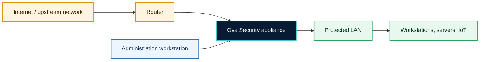

Ova Security is positioned as a local edge appliance. Its main role is to become the security coordination point between the upstream network, the protected network, and the administrator.

At a high level, the appliance provides:

- a controlled network position;
- security event collection;
- asset and traffic visibility;
- alert analysis;
- vulnerability insight;
- evidence preservation;
- administration and reporting.

## 3. Wired network architecture

The appliance is designed around a wired segmentation model. The exact interface names and addresses are intentionally not published, but the logical separation remains clear.

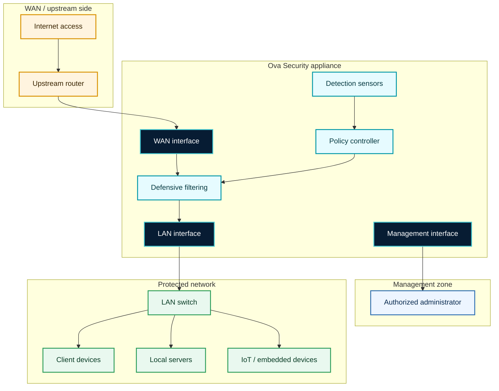

### Security zones

| Zone | Purpose |
| --- | --- |
| WAN side | Receives upstream connectivity and untrusted traffic. |
| Protected LAN | Contains the internal devices supervised by the appliance. |
| Management zone | Reserved for authorized administration and maintenance. |
| Appliance core | Centralizes filtering, detection, analysis, evidence, and reporting. |

### Default posture

- Outgoing traffic can be controlled according to policy.
- Incoming access to protected assets is restricted by default.
- Management access is isolated from ordinary user traffic.
- Sensitive rules are tied to validation and traceability.

## 4. Internal logical architecture

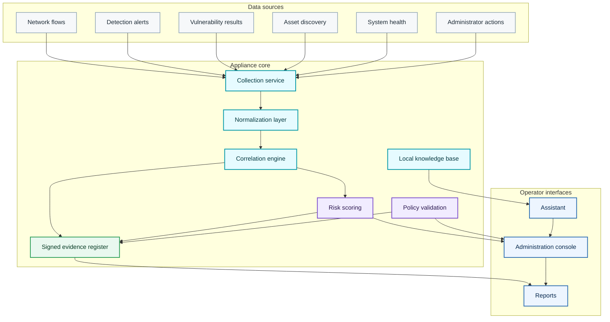

The internal architecture is separated into data sources, appliance core services, and operator-facing interfaces. This separation keeps the solution maintainable and makes it easier to evolve one function without rewriting the whole system.

## 5. Functional modules

| Module | Responsibility | Public implementation idea |
| --- | --- | --- |
| Asset inventory | Discover and classify devices visible from the supervised network. | Active and passive observations are consolidated into an asset list. |
| Traffic observation | Understand who communicates with whom and when. | Flow metadata is collected and summarized for supervision. |
| Intrusion detection | Identify suspicious activity patterns. | Security alerts are normalized and attached to assets. |
| Vulnerability analysis | Detect exposed services and prioritize weaknesses. | Results are mapped to assets and severity levels. |
| Defensive filtering | Reduce exposure and block unauthorized access patterns. | Rules are controlled and linked to administrator validation. |
| Administration console | Give the operator a readable control surface. | Assets, alerts, risks, services, and reports are grouped by operational need. |
| Evidence register | Preserve important events and decisions. | Records are chained, signed, and kept locally. |
| Assistant | Explain alerts, reports, and documentation. | Retrieval-augmented context supports human decision-making. |
| Resilience monitor | Track service health and degraded modes. | Essential functions remain visible when one component is unhealthy. |
| Reporting | Produce useful summaries for operation and audit. | Executive, asset, incident, and integrity-oriented reports can be generated. |

## 6. Technology role map

The architecture can integrate several open-source components. This repository describes their role at a public level and does not publish internal configuration.

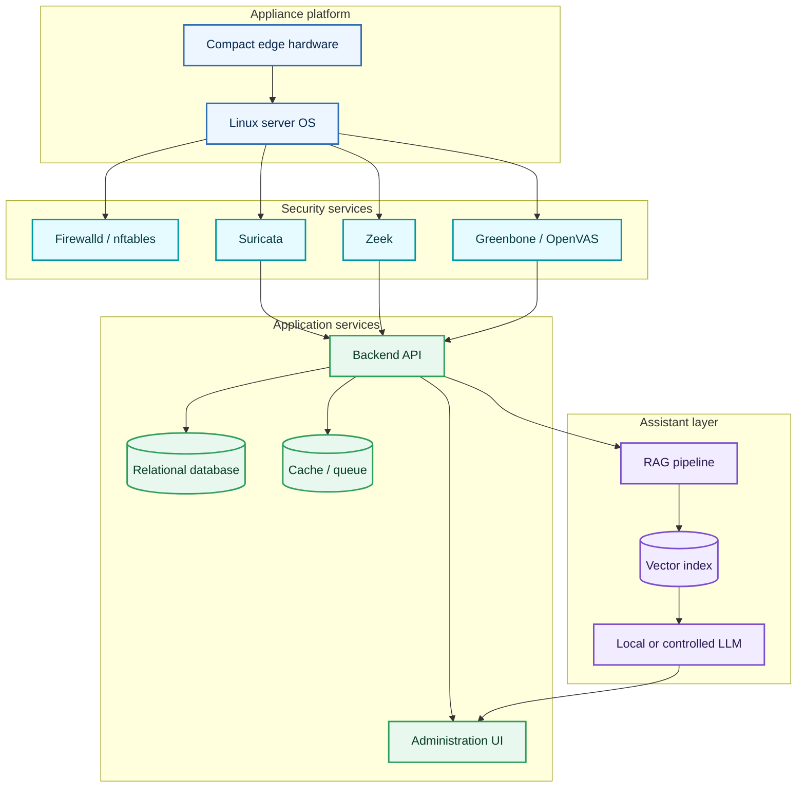

| Technology family | Architectural role |
| --- | --- |
| Compact edge hardware | Hosts the appliance close to the protected network. |
| Linux server OS | Provides system services, networking, scheduling, and service supervision. |
| Firewalld / nftables | Provides defensive filtering and policy enforcement. |
| Suricata | Produces intrusion detection alerts from observed traffic. |
| Zeek | Produces network telemetry and protocol-level visibility. |
| Greenbone / OpenVAS | Supports vulnerability analysis and remediation prioritization. |
| Web administration layer | Exposes controlled supervision, reports, and operator actions. |
| Database layer | Stores assets, alerts, reports, state, and evidence metadata. |
| Cache / queue layer | Helps decouple collection, processing, and interface updates. |
| RAG and LLM layer | Supports contextual explanation and decision assistance. |

## 7. Data domains

Ova Security separates operational data into domains. This makes the system easier to audit and avoids mixing raw security signals with decisions or reports.

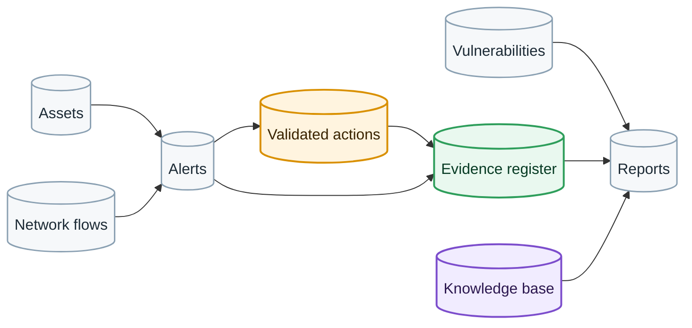

| Domain | Description | Retention intent |
| --- | --- | --- |
| Assets | Devices, status, classification, and risk context. | Kept while the device is part of the supervised environment. |
| Flows | Metadata describing communications and service activity. | Rotated and summarized to avoid uncontrolled growth. |
| Alerts | Detection events and contextual security findings. | Preserved according to operational relevance. |
| Vulnerabilities | Weaknesses mapped to assets and services. | Refreshed after scans and remediation cycles. |
| Actions | Human-approved decisions and administrative changes. | Preserved as governance evidence. |
| Evidence | Integrity-oriented records for sensitive events. | Protected from uncontrolled deletion. |
| Reports | Human-readable summaries for operations and audits. | Generated on demand or scheduled. |
| Knowledge base | Documentation used by the assistant. | Updated independently from the language model. |

## 8. Event and decision flow

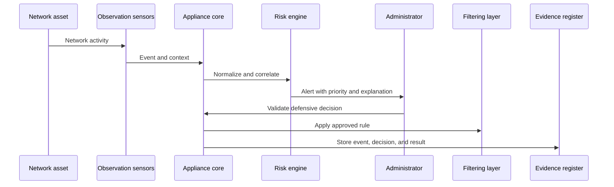

The flow is built to avoid blind automation. Detection and analysis can be automated, but sensitive response remains controlled by a human decision.

## 9. Log management and traceability

Ova Security treats logs as operational evidence, not as a storage problem. The log pipeline is designed to reduce volume while preserving traceability.

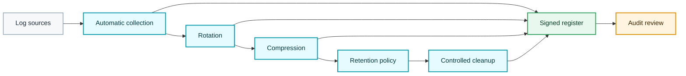

### Log pipeline objectives

- Collect useful events automatically.
- Reduce file growth through rotation and compression.
- Keep retention predictable.
- Avoid deleting evidence without control.
- Preserve a verifiable trail of important actions.

## 10. Integrity register

The register is designed to make sensitive events verifiable after they are stored. It links each important event to integrity metadata and preserves a chain between records.

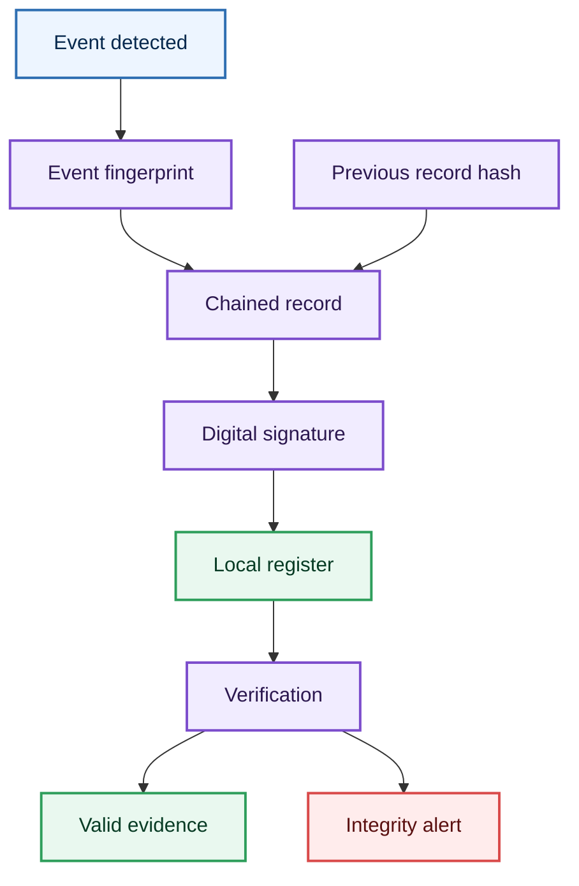

The objective is not to publish a blockchain system. The objective is to keep a local, verifiable, tamper-evident register for security-relevant actions.

### Examples of records

- Detection alert accepted by the operator.
- Filtering decision validated by an administrator.
- Configuration change.
- Service degradation or recovery event.
- Vulnerability report generation.
- Integrity verification result.

## 11. Assistant architecture

The assistant is used to make security information understandable. It can interpret alerts, reports, screenshots, and documentation, but it remains a support layer.

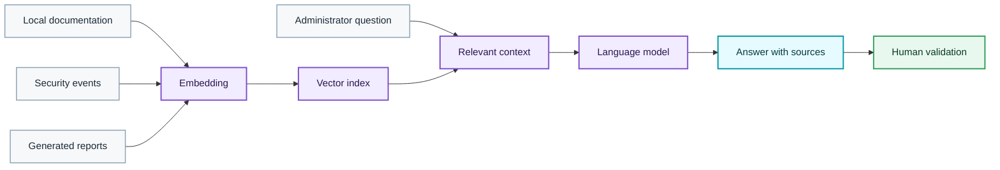

### Assistant guardrails

- It explains and recommends; it does not replace the administrator.
- It should cite the context used for its answer.
- It should avoid actions that are not validated.
- It should not require publishing private operational data.
- It should remain aligned with the defensive scope of the appliance.

## 12. Resilience model

The appliance must remain understandable even when a component is degraded. The resilience model tracks service health and separates normal operation from degraded and safe states.

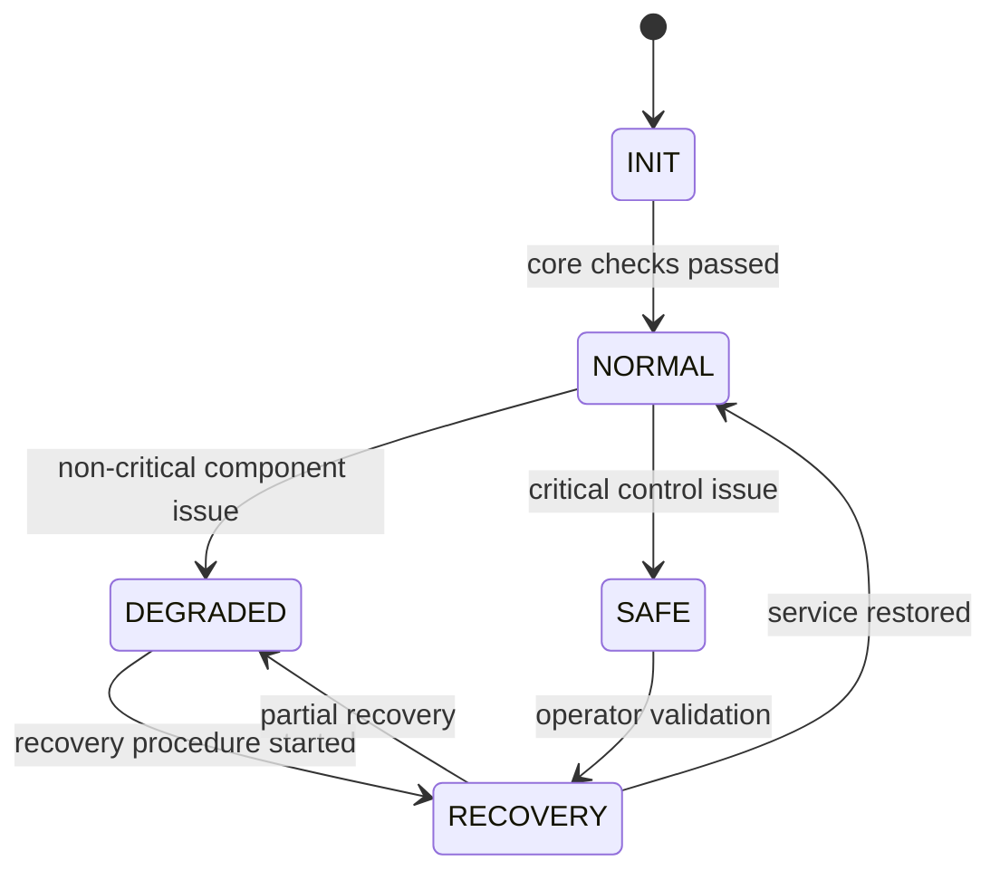

| Mode | Meaning | Expected behavior |
| --- | --- | --- |
| INIT | Appliance startup and service checks. | Verify core services before declaring the appliance ready. |
| NORMAL | Main services are available. | Full supervision, alerting, reporting, and evidence recording. |
| DEGRADED | One non-critical function is impaired. | Keep essential monitoring and show the affected function clearly. |
| RECOVERY | The appliance attempts restoration. | Record recovery steps and notify the operator. |
| SAFE | A critical condition requires caution. | Limit behavior to essential defensive functions and require attention. |

## 13. Administration and governance

Administration is intentionally separated from ordinary network use. The architecture is designed around clear roles, controlled actions, and traceable decisions.

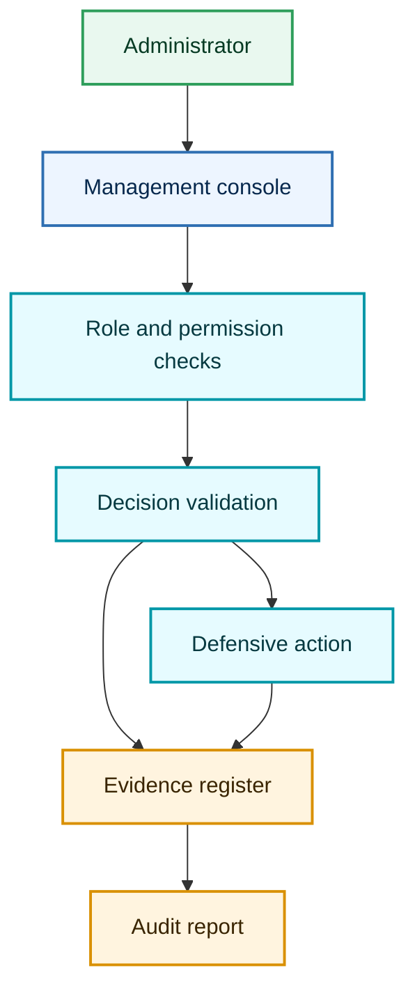

### Governance rules

- Administrators must be identifiable.
- Sensitive actions must be validated.
- Changes should be traceable.
- Evidence should remain local and verifiable.
- The assistant must not execute uncontrolled decisions.
- Reports should be understandable by technical and non-technical reviewers.

## 14. Validation approach

The architecture can be validated by comparing a baseline environment with an environment protected and supervised by the appliance.

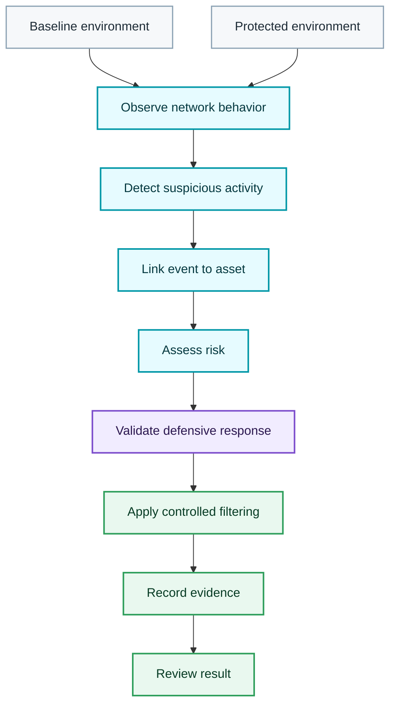

### Validation criteria

- Devices are discovered and classified.
- Suspicious activity is detected.
- Alerts are linked to assets.
- Risk indicators are understandable.
- Defensive responses remain controlled.
- Evidence is preserved for later review.
- Degraded states are visible.
- Reports remain useful for operational review.

## 15. Public boundaries

This repository is designed for public presentation. It intentionally excludes:

- source code;
- exact production configuration;
- firewall rule exports;
- private prompts and datasets;
- keys, credentials, tokens, certificates, and secrets;
- private IP addresses and operational endpoints;
- raw logs, packet captures, and customer data;
- screenshots containing private information;
- offensive commands or reproducible attack instructions.

## 16. License

This repository is proprietary documentation. The public availability of the repository does not grant the right to copy, reuse, resell, mirror, or derive a competing template or product from this material.

See [LICENSE](LICENSE).
