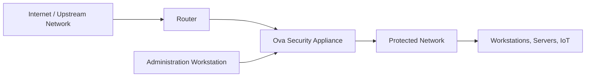

# Ova Security

Ova Security is a compact cyber appliance architecture designed to improve local network visibility, defensive control, traceability, and decision support.

This repository presents the public architecture of the project. It does not include source code, credentials, operational rules, exploit procedures, private datasets, or deployment secrets.

## Purpose

The project addresses a common gap in small and medium environments: security tools are often scattered, logs are difficult to exploit, and incident decisions are hard to justify after the fact.

Ova Security brings the main defensive functions into a single local appliance:

- network visibility and device inventory;
- intrusion and suspicious activity detection;
- traffic filtering and controlled blocking;
- vulnerability prioritization;
- signed evidence and audit traceability;
- assisted interpretation for administrators.

## High-level architecture

The appliance is positioned at the edge of the protected network. It observes traffic, collects security events, applies approved defensive policies, and keeps local evidence for later review.

## Core capabilities

| Capability | Public description |
| --- | --- |
| Asset visibility | Identifies active devices and gives the administrator a clear view of the supervised environment. |
| Detection | Correlates alerts and network observations to identify suspicious activity. |
| Defensive filtering | Applies controlled network filtering policies after administrative validation. |
| Vulnerability insight | Helps prioritize exposed services and weaknesses that require remediation. |
| Traceability | Records sensitive actions in an integrity-oriented local register. |
| Decision support | Helps interpret events and reports without replacing the human decision. |

## Public documentation

- [Architecture overview](docs/architecture.md)
- [Functional modules](docs/modules.md)
- [Traceability and evidence model](docs/traceability.md)
- [Resilience model](docs/resilience.md)
- [Assistant architecture](docs/assistant.md)
- [Validation approach](docs/validation.md)
- [Security policy](SECURITY.md)

## Repository scope

This public repository is intentionally limited to architecture and product-level documentation.

It does not publish:

- source code of the appliance;
- firewall rules or operational configurations;
- credentials, keys, tokens, or private endpoints;
- attack playbooks or offensive instructions;
- private screenshots or internal reports;
- personally identifiable information.

## License

This repository is provided for public presentation only. The content, diagrams, product identity, and architecture documentation are proprietary. See [LICENSE](LICENSE).

