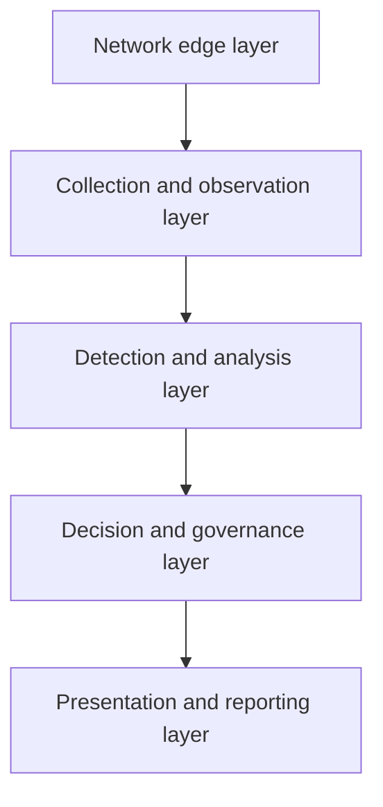
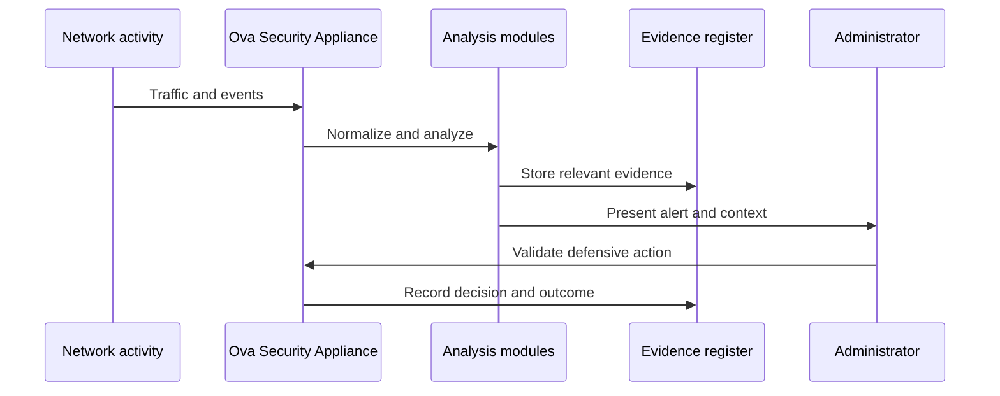
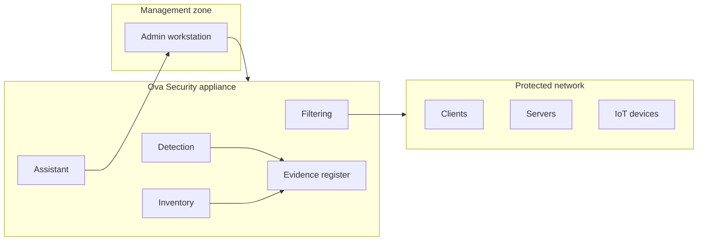

# Architecture overview

Ova Security is organized as a local edge appliance. Its role is to sit near the protected network, centralize useful security signals, and help the administrator move from observation to controlled action.

## Design principles

- **Local-first operation**: important data remains on the appliance or inside the controlled environment.
- **Defensive posture**: the system is designed for monitoring, filtering, audit, and remediation support.
- **Human validation**: sensitive actions remain under administrator control.
- **Traceability by design**: important events and decisions are written in a verifiable register.
- **Operational simplicity**: the appliance hides unnecessary infrastructure complexity from the daily operator.

## Logical layers

### Network edge layer

This layer receives network flows from the environment and provides the controlled point where filtering policies can be applied.

### Collection and observation layer

This layer collects events, device information, network activity, and service status from the supervised environment.

### Detection and analysis layer

This layer transforms raw observations into security signals: suspicious behavior, vulnerable services, unusual traffic, and priority indicators.

### Decision and governance layer

This layer keeps the administrator in control. It links decisions to roles, timestamps, evidence, and validation state.

### Presentation and reporting layer

This layer exposes a readable view of the environment: devices, alerts, risks, service health, and audit-ready summaries.

## Simplified data flow

## Deployment view

