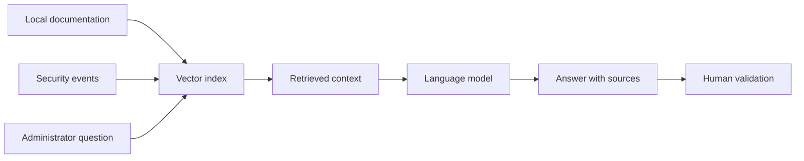

# Assistant architecture

The assistant component is designed to help administrators understand security information faster. It is a decision-support layer, not an autonomous authority.

## Role

The assistant can help with:

- explaining alerts in plain language;
- summarizing reports;
- connecting an event to available documentation;
- suggesting next checks;
- preparing a response that still requires validation.

## RAG-oriented architecture

## Guardrails

- The assistant explains and recommends; it does not decide alone.
- Sensitive actions require human validation.
- Responses should reference the context used.
- Private operational data should stay inside the controlled environment.
- The assistant should remain useful even when the external network is unavailable.

## Public boundary

This document does not disclose prompts, private datasets, internal embeddings, model credentials, or production configuration.

