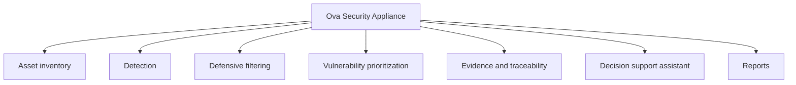

# Functional modules

The architecture is built around several modules that work together but remain logically separated. This separation helps with maintainability, auditability, and progressive evolution.

## Module map

## Asset inventory

The inventory module identifies active devices and keeps a readable view of the supervised environment. It supports the administrator by answering basic operational questions:

- which devices are active;
- which devices are known or unknown;
- which assets require attention;
- which systems are involved in an alert.

## Detection

The detection module consumes network and system observations to identify suspicious activity. Its role is not only to raise alerts, but also to attach context to them.

Public examples of detection categories:

- unusual connection patterns;
- repeated access attempts;
- suspicious traffic behavior;
- activity linked to a risky device.

## Defensive filtering

The filtering module applies controlled defensive rules. The public architecture keeps the following principle: sensitive blocking decisions should be explainable, traceable, and approved.

## Vulnerability prioritization

The vulnerability module helps identify exposed services and weaknesses that should be corrected first. The objective is prioritization, not noise generation.

## Evidence and traceability

The evidence module keeps important actions and decisions in a local register. It supports audits, incident review, and accountability.

## Decision support assistant

The assistant helps interpret alerts, reports, and documentation. It should support the administrator without replacing the administrator.

## Reporting

The reporting module produces summaries that can be used for operational follow-up, management visibility, and audit preparation.

