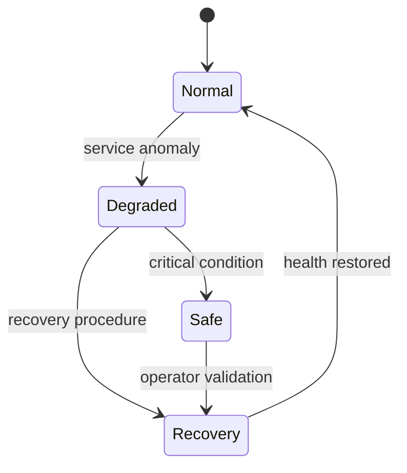

# Resilience model

The appliance is expected to continue providing essential defensive functions even when some services are degraded.

## Resilience goals

- detect service degradation;
- keep essential visibility available;
- preserve local evidence;
- avoid unsafe automated behavior;
- support recovery without losing operational context.

## Operating modes

## Mode summary

| Mode | Meaning |
| --- | --- |
| Normal | Core services are available and the appliance operates as expected. |
| Degraded | A non-critical component is unavailable, but essential monitoring continues. |
| Recovery | The appliance attempts to restore service health and records the recovery process. |
| Safe | The appliance limits activity to essential defensive behavior and requires operator attention. |

## Design intent

Resilience is not only technical availability. It also protects trust: the system should keep a clear record of what changed, what failed, and how it recovered.

