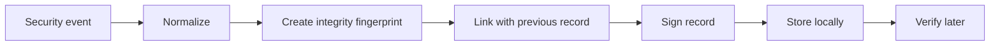

# Traceability and evidence model

Traceability is a central part of the Ova Security architecture. The goal is to make important security decisions reviewable after the fact.

## What is recorded

The public model records the type of information needed to understand a decision without exposing sensitive implementation details:

- event category;
- impacted asset;
- severity or priority;
- administrative decision;
- timestamp;
- validation status;
- outcome;
- integrity metadata.

## Evidence chain

## Governance value

This model helps answer questions such as:

- What happened?
- Which asset was involved?
- Who validated the response?
- Was the record modified later?
- Can the evidence be presented during a review?

## Public boundary

This repository intentionally does not publish private signing keys, concrete rule formats, production logs, or internal event schemas.

