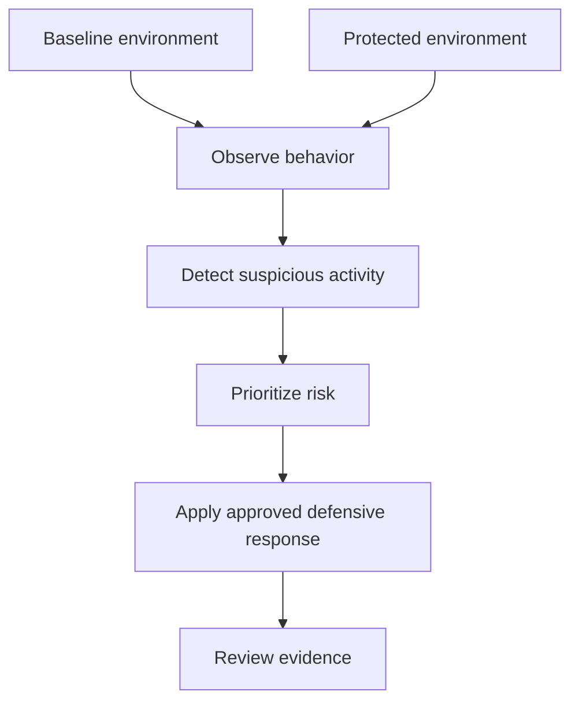

# Validation approach

The project was validated through controlled scenarios comparing a directly exposed environment with an environment supervised by the appliance.

This repository keeps the validation description at a public and defensive level. It does not provide offensive commands or reproducible attack instructions.

## Scenario model

## Validation criteria

- devices are discovered and classified;
- suspicious activity is detected;
- events are associated with relevant assets;
- risk indicators are understandable;
- defensive decisions are traceable;
- evidence remains available for review;
- degraded modes are identifiable.

## Result interpretation

The validation confirms the value of a centralized defensive appliance: better visibility, faster understanding, more controlled response, and stronger traceability.

## Public boundary

The repository intentionally excludes attack tooling details, real credentials, IP addresses, screenshots containing private data, and operational configurations.

